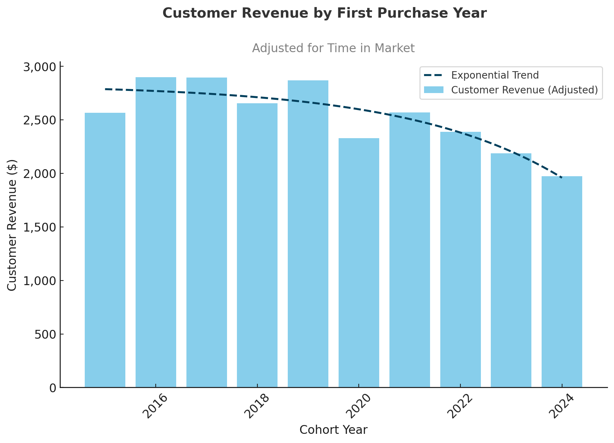

## Overview
Analysis of customer behavior, retention, and lifetime value for an e-commerce company to improve customer retention and maximize revenue.
## Skills Demonstrated
SQL for Analytics: Complex joins, CTEs, subqueries, and window functions to clean, aggregate, and analyze sales data.

Customer Analytics: Segmentation, cohort analysis, LTV (lifetime value), and retention/churn modeling.

Business Problem Solving: Translating raw sales data into insights that guide marketing, retention, and revenue strategies.

Data Visualization & Storytelling: Presenting results with clear charts and actionable business insights.

Tooling: PostgreSQL for querying, DBeaver for execution, and visualization support with ChatGPT.
## Methodology

### Data Source
This analysis uses the **Contoso 100k datasets** from Microsoft, which are fictional but designed to mimic real-world e-commerce business scenarios. The datasets include:
- **Customer data**: Demographics, registration dates, and contact information for customers
- **Transaction data**: Detailed purchase history with order dates, product details, quantities, and revenue
- **Product catalog**: Item descriptions, categories, and pricing information

These datasets simulate a B2C e-commerce platform with realistic customer behavior patterns, seasonal trends, and business metrics.

### Data Validation and Quality Checks
Before analysis, the following validation steps were performed:
- **Completeness checks**: Verified no critical missing values in key fields (customer_id, order_date, revenue)
- **Duplicate detection**: Identified and removed duplicate transactions using composite keys
- **Data type validation**: Ensured date fields are properly formatted and numeric fields contain valid values
- **Range validation**: Confirmed order dates fall within expected business periods (2016-2024)
- **Referential integrity**: Validated foreign key relationships between customers and transactions

### Key Assumptions
- **Analysis timeframe**: Focus on transactions from 2016-2024, assuming complete data coverage
- **Currency**: All revenue figures in USD
- **Customer identification**: Unique customer_id represents individual customers
- **Churn definition**: Customers with no purchases in the last 6 months are considered at risk (As fictional datasets doesn't contain recent data we use MAX(orderdate))
- **Cohort stability**: Customer cohorts defined by first purchase year remain consistent

### Key Calculations and Definitions

#### Lifetime Value (LTV)
```sql
-- Calculate total LTV per customer
SUM(revenue) OVER (PARTITION BY customerkey) AS total_ltv
```
- LTV is calculated as the total revenue generated by each customer across all purchases over the entire analysis period
- Uses window function to aggregate all transaction revenue by customerkey

#### Customer Segmentation
Customer segmentation is based on LTV percentiles across the entire customer base:
```sql
-- Calculate 25th and 75th percentiles of LTV
PERCENTILE_CONT(0.25) WITHIN GROUP (ORDER BY total_ltv) AS percentile_25th,
PERCENTILE_CONT(0.75) WITHIN GROUP (ORDER BY total_ltv) AS percentile_75th

-- Apply segmentation logic
CASE
    WHEN c.total_ltv < percentile_25th THEN '1 - Low-Value'
    WHEN c.total_ltv BETWEEN percentile_25th AND percentile_75th THEN '2 - Mid-Value'
    ELSE '3 - High-Value'
END AS customer_segment
```
- **Low-Value**: Bottom 25% of customers by LTV (< 25th percentile)
- **Mid-Value**: Middle 50% of customers by LTV (25th to 75th percentile)  
- **High-Value**: Top 25% of customers by LTV (> 75th percentile)

#### Cohort Analysis
- **Cohort definition**: Customers grouped by the year of their first purchase
- **Cohort metrics**: Revenue and customer count tracked monthly/quarterly within each cohort
- **Normalization**: Revenue adjusted for time in market to compare cohorts fairly

#### Retention/Churn Analysis
- **Retention rate**: Percentage of customers from a cohort who made purchases in subsequent periods
- **Churn rate**: 1 - Retention rate
- **At-risk customers**: Those with last purchase >6 months ago

### Data Preparation Process
The initial data cleaning and aggregation (see [0_create_view.sql](0_create_view.sql)) involved:
- Joining customer and transaction tables
- Calculating first purchase dates for cohort assignment
- Aggregating transaction-level data to customer-level metrics
- Creating derived fields for analysis (days since last purchase, total orders, etc.)
## Business Questions
1. **Customer Segmentation:** Who are our most valuable customers?
2. **Cohort Analysis:** How do different customer groups generate revenue?
3. **Retention Analysis:** Which customers haven't purchased recently?

## Clean Up Data

**🖥️ Query**: [0_create_view.sql](0_create_view.sql)

- Aggregated sales and customer data into revenue metrics
- Calculated first purchase dates for cohort analysis
- Created view combining transactions and customer details

## Analysis

### 1. Customer Segmentation

**🖥️ Query**: [1_customer_segmentation.sql](1_customer_segmentation.sql)

- Categorized customers based on total lifetime value (LTV)
- Assigned customers to High, Mid, and Low-value segments
- Calculated key metrics like total revenue

**📈 Visualization:**

<p align="center">
  
</p>


📊 **Key Findings:**
- High-value segment (25% of customers) drives 66% of revenue ($135.4M)
- Mid-value segment (50% of customers) generates 32% of revenue ($66.6M)
- Low-value segment (25% of customers) accounts for 2% of revenue ($4.3M)

💡 **Business Insights**
- High-Value (66% revenue): Offer premium membership program to 12,372 VIP customers, as losing one customer significantly impacts revenue
- Mid-Value (32% revenue): Create upgrade paths through personalized promotions, with potential $66.6M → $135.4M revenue opportunity
- Low-Value (2% revenue): Design re-engagement campaigns and price-sensitive promotions to increase purchase frequency

### 2. Customer Revenue by Cohort
**🖥️ Query**: [2_cohort_analysis.sql](2_cohort_analysis.sql)

- Tracked revenue and customer count per cohorts
- Cohorts were grouped by year of first purchase
- Analyzed customer revenue at a cohort level

**📈 Visualization:**

> ⚠️ Note: This only includes 2 charts. 

Customer Revenue by Cohort (Adjusted for time in market) - First Purchase Date 

<p align="center">
  
</p>


Investigate Monthly Revenue & Customer Trends (3 Month Rolling Average)

<p align="center">
  
</p>


📊 **Key Findings:**  
- Customer revenue is declining, older cohorts (2016-2018) spent ~$2,800+, while 2024 cohort spending dropped to ~$1,970.  
- Revenue and customers peaked in 2022-2023, but both are now trending downward in 2024.  
- High volatility in revenue and customer count, with sharp drops in 2020 and 2024, signaling retention challenges.  

💡 **Business Insights:**  
- Boost retention & re-engagement by targeting recent cohorts (2022-2024) with personalized offers to prevent churn.  
- Stabilize revenue fluctuations and introduce loyalty programs or subscriptions to ensure consistent spending.  
- Investigate cohort differences by applying successful strategies from high-spending cohorts (2016-2018) to newer ones.

### 3. Customer Retention
🖥️ Query: [3_retention_analysis.sql](3_retention_analysis.sql)

- Identified customers at risk of churning
- Analyzed last purchase patterns
- Calculated customer-specific metrics

**📈 Visualization:**

<p align="center">
  
</p>


📊 **Key Findings:**  
- Cohort churn stabilizes at ~90% after 2-3 years, indicating a predictable long-term retention pattern.  
- Retention rates are consistently low (8-10%) across all cohorts, suggesting retention issues are systemic rather than specific to certain years.  
- Newer cohorts (2022-2023) show similar churn trajectories, signaling that without intervention, future cohorts will follow the same pattern.  

💡 **Business Insights:**  
- Strengthen early engagement strategies to target the first 1-2 years with onboarding incentives, loyalty rewards, and personalized offers to improve long-term retention.  
- Re-engage high-value churned customers by focusing on targeted win-back campaigns rather than broad retention efforts, as reactivating valuable users may yield higher ROI.  
- Predict & preempt churn risk and use customer-specific warning indicators to proactively intervene with at-risk users before they lapse.

## Strategic Recommendations

1. **Customer Value Optimization** (Customer Segmentation)
   - Launch VIP program for 12,372 high-value customers (66% revenue)
   - Create personalized upgrade paths for mid-value segment ($66.6M → $135.4M opportunity)
   - Design price-sensitive promotions for low-value segment to increase purchase frequency

2. **Cohort Performance Strategy** (Customer Revenue by Cohort)
   - Target 2022-2024 cohorts with personalized re-engagement offers
   - Implement loyalty/subscription programs to stabilize revenue fluctuations
   - Apply successful strategies from high-spending 2016-2018 cohorts to newer customers

3. **Retention & Churn Prevention** (Customer Retention)
   - Strengthen first 1-2 year engagement with onboarding incentives and loyalty rewards
   - Focus on targeted win-back campaigns for high-value churned customers
   - Implement proactive intervention system for at-risk customers before they lapse
   

## Real-World Application

This project mirrors challenges faced by e-commerce and retail businesses worldwide:

Customer Value Optimization → Identifying high-value customers to design VIP loyalty programs.

Revenue Stability → Using cohort analysis to spot declining trends and apply successful strategies from strong cohorts.

Retention & Churn Prevention → Building early engagement and win-back campaigns to reduce customer loss.

By solving these business questions with SQL, the project demonstrates how data analysts can drive revenue growth, improve retention, and inform strategic decision-making in a real-world business environment.
